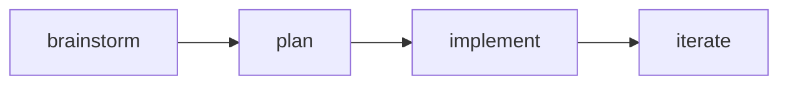

import Callout from '../components/Callout.astro';
import Steps from '../components/Steps.astro';
import Figure from '../components/Figure.astro';
import SideNote from '../components/SideNote.astro';
import Island from '../components/Island.tsx';

This is the house-rules doc template — the frozen "house style".<SideNote>“Frozen” means an agent composes the locked components and writes prose; it does **not** edit `theme.css` or add freehand CSS.</SideNote> Agents author content only: plain markdown plus a locked component set. Delete this file once real docs exist.

## What renders here

Prose, tables, code, math, and diagrams — all from `.mdx`.<SideNote>Body is Public Sans, headings Source Serif 4, code IBM Plex Mono. One burnt-orange accent throughout.</SideNote>

| Feature | Via |
| --- | --- |
| Syntax highlighting | Shiki |
| Math | KaTeX |
| Diagrams | Mermaid |
| Interactivity | React (baseline) |

```ts
function greet(name: string) {
  return `hello, ${name}`;
}
```

Inline math $E = mc^2$ and a block:

$$
\int_0^1 x^2 \, dx = \tfrac{1}{3}
$$

## Locked components

<Callout label="note">
  Compose these; pass children and props. Never reach into their internals or add inline styles.
</Callout>

<Steps>
1. Shape the idea into a spec.
2. Turn the spec into a plan.
3. Build the plan.
4. Iterate on feedback.
</Steps>

<Figure
  src="data:image/svg+xml;utf8,<svg xmlns='http://www.w3.org/2000/svg' width='320' height='120'><rect width='320' height='120' fill='%23f6efe3'/><text x='160' y='66' font-family='monospace' font-size='14' fill='%23c2540f' text-anchor='middle'>figure placeholder</text></svg>"
  alt="placeholder"
  caption="Figure — captioned image, caption in mono."
/>

<Island client:load title="Interactive island · React">
  The dashed frame and header are the theme's; everything inside is the island author's.
</Island>

## The loop


