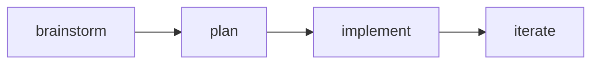

This is the house-rules doc template. Delete this file once real docs exist.

## What renders here

Prose, tables, code, math, and diagrams — all from `.mdx`.

| Feature | Via |
| --- | --- |
| Syntax highlighting | Shiki |
| Math | KaTeX |
| Diagrams | Mermaid |
| Interactivity | React (on-demand) |

```ts
function greet(name: string) {
  return `hello, ${name}`;
}
```

Inline math $E = mc^2$ and a block:

$$
\int_0^1 x^2 \, dx = \tfrac{1}{3}
$$


